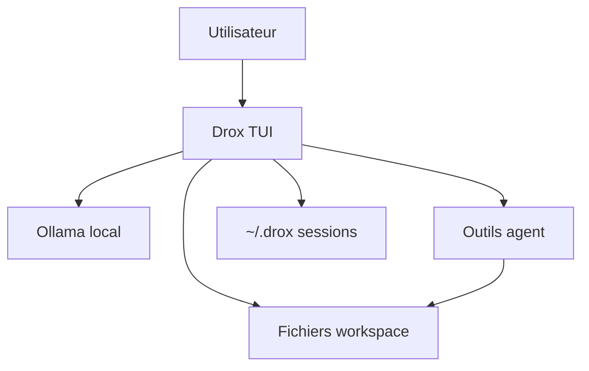

# Drox TUI — agent local en terminal

> **Version produit : `2.0.2`** · Moteur dérivé de **Drox IDE `1.5.0`**

**Drox TUI** est un assistant IA en terminal : LLM local (Ollama par défaut), fichiers, shell, permissions, sessions — **sans cloud obligatoire**.

> ### 🔒 Certification locale
>
> **Aucune télémétrie, aucun cloud Drox, aucun « phone home ».**
>
> - **Données** : sessions, préférences et logs restent **sur votre disque** (`~/.drox/`, workspace).
> - **Inférence IA** : vers **votre** serveur LLM (défaut **Ollama `127.0.0.1:11434`**).
> - **Au démarrage** : aucune requête Internet, **sauf** la vérification de mise à jour si vous l’activez.
> - **Exception unique — mises à jour (opt-in)** : le client peut **vérifier périodiquement** ce dépôt de releases pour une nouvelle version et afficher les **notes de release**. **C’est le seul canal** entre le client TUI et l’extérieur côté produit Drox.
> - **Agent** : le réseau n’est utilisé que si vous configurez un LLM distant ou si l’agent invoque un outil web/MCP — sous **vos** permissions (`allow` / `ask` / `deny`).

**Releases officielles** : [github.com/DroxKiwi/Drox---TUI---OR](https://github.com/DroxKiwi/Drox---TUI---OR)

---

## Sommaire (FR)

1. [Installation](#installation)
2. [Démarrage rapide](#démarrage-rapide)
3. [Fonctionnalités](#fonctionnalités)
4. [Raccourcis et commandes](#raccourcis-et-commandes)
5. [Permissions et mode plan](#permissions-et-mode-plan)
6. [Sessions et fichiers de config](#sessions-et-fichiers-de-config)
7. [Mises à jour](#mises-à-jour)
8. [English version](#english-version)

---

## Installation

**Prérequis** : [Ollama](https://ollama.com/) (ou serveur compatible), terminal moderne (Windows Terminal recommandé).

### Windows x64

1. Téléchargez `drox-tui-2.0.2-windows-x64-setup.exe` depuis le dépôt [Drox---TUI---OR](https://github.com/DroxKiwi/Drox---TUI---OR) (`releases/v2.0.2/`).
2. Lancez l’**installateur** (double-clic) et suivez l’assistant.
3. Cochez **Ajouter au PATH** si proposé.

Le binaire est installé dans `%LOCALAPPDATA%\Programs\DroxTUI\bin`. Ouvrez un **nouveau** terminal.

Désinstallation : Paramètres Windows → Applications → Drox TUI.

### Linux x64

1. Téléchargez `drox-tui-2.0.2-linux-x64.tar.gz` depuis [Releases](https://github.com/DroxKiwi/Drox---TUI---OR/releases).
2. Extrayez et installez :

```bash
tar xzf drox-tui-2.0.2-linux-x64.tar.gz
cd drox-tui-2.0.2-linux-x64
./install.sh              # ~/.local/bin
# ou : ./install.sh --system   # /usr/local/bin (sudo)
```

Vérifiez : `drox-tui --list-sessions`

---

## Démarrage rapide

```powershell
cd C:\chemin\vers\votre-projet
drox-tui --workspace .
```

Au **premier lancement**, la modale **Connexion IA** s’ouvre (`Ctrl+Shift+L` ou `/server`) : adresse Ollama, test, modèle, taille de contexte. La configuration est enregistrée dans `~/.drox/tui-preferences.json`.

| Option | Rôle |
|---|---|
| `--workspace` | Dossier de travail de l’agent |
| `--apply` | Autorise les écritures fichier réelles |
| `--plan` | Mode plan (pas d’écriture sans validation) |
| `--session ses_…` | Reprend une session |
| `--list-sessions` | Liste les sessions |
| `-v` | Logs dans `~/.drox/tui.log` |

Variables d’environnement : `DROX_SERVER`, `DROX_MODEL`, `DROX_WORKSPACE`, `DROX_API_KEY`.

---

## Fonctionnalités



- **Fil de conversation** : streaming, markdown, outils, phases repliables
- **Composer** : vim (`/vim`), `@fichier`, collage intelligent, images (Ollama)
- **Agent** : lecture/écriture fichiers, grep, bash, web (avec permission), MCP, todos, plan
- **Permissions** : modales avec aperçu (diff, commande bash, plan)
- **Sessions** : reprise, export, rewind
- **Personnalisation** : thèmes, raccourcis clavier, workspaces récents

Sans `--apply`, les modifications fichier sont **proposées** mais non appliquées sur disque.

---

## Raccourcis et commandes

| Raccourci | Action |
|---|---|
| `Ctrl+Shift+L` | Connexion serveur IA |
| `Ctrl+Shift+W` | Changer de workspace |
| `Ctrl+F` | Rechercher dans le fil |
| `Ctrl+R` | Recherche dans l’historique |
| `Esc` / `Ctrl+C` | Annuler un run |
| `e` | Agrandir une sortie d’outil |
| `/help` | Liste des commandes slash |

Commandes utiles : `/server`, `/workspace`, `/settings`, `/theme`, `/permissions`, `/compact`, `/export`, `/doctor`, `/update` (mises à jour).

---

## Permissions et mode plan

Règles dans `~/.drox/settings.json` et `<workspace>/.drox/settings.json`.

| Mode | Effet |
|---|---|
| Défaut | Demandes fréquentes avant écriture ou bash |
| `--plan` | Plan à valider avant exécution |
| `--apply` | Écritures réelles sur disque |
| `--allow` / `--deny` | Affinage par outil |

---

## Sessions et fichiers de config

```text
~/.drox/
├── tui-preferences.json   # LLM, thème, MAJ
├── keybindings.json
├── settings.json
├── sessions/              # transcripts
└── tui.log                # logs (-v)

<workspace>/.drox/         # réglages et mémoire projet
```

---

## Mises à jour

Par défaut, **aucune** vérification automatique.

- Activez les checks dans `/settings` ou `/update on`
- Un **bandeau** propose d’installer une nouvelle release (raccourci dédié)
- **Plus tard** : reporte la notification
- Seule communication produit Drox vers l’extérieur : **vérification de version** sur ce dépôt de releases (opt-in)

Téléchargements et notes : [Releases](https://github.com/DroxKiwi/Drox---TUI---OR/releases).

---

## Licence

MIT — voir le fichier `LICENSE` fourni avec l’archive d’installation.

---

---

# English version

> **Product version: `2.0.2`** · Engine derived from **Drox IDE `1.5.0`**

**Drox TUI** is a terminal AI assistant: local LLM (Ollama by default), files, shell, permissions, sessions — **no mandatory cloud**.

> ### 🔒 Local certification
>
> **No telemetry, no Drox cloud, no phone home.**
>
> - **Data** stays **on your disk** (`~/.drox/`, workspace).
> - **AI inference** goes to **your** LLM server (default **Ollama `127.0.0.1:11434`**).
> - **At startup**: no Internet requests, **except** update checks if you enable them.
> - **Single exception — updates (opt-in)**: the client may **periodically** check this release repository for a new version and show **release notes**. This is the **only product-side channel** between the TUI and the outside world.
> - **Agent**: network use only if you configure a remote LLM or the agent calls web/MCP tools — under **your** permission rules.

**Official releases**: [github.com/DroxKiwi/Drox---TUI---OR](https://github.com/DroxKiwi/Drox---TUI---OR)

---

## Table of contents (EN)

1. [Installation](#installation-1)
2. [Quick start](#quick-start)
3. [Features](#features)
4. [Shortcuts and commands](#shortcuts-and-commands)
5. [Permissions and plan mode](#permissions-and-plan-mode-1)
6. [Sessions and config files](#sessions-and-config-files)
7. [Updates](#updates)
8. [License](#license-1)

---

## Installation

**Requirements**: [Ollama](https://ollama.com/) (or compatible server), modern terminal.

### Windows x64

1. Download `drox-tui-2.0.2-windows-x64-setup.exe` from [Drox---TUI---OR](https://github.com/DroxKiwi/Drox---TUI---OR) (`releases/v2.0.2/`).
2. Run the **installer** and follow the wizard.
3. Enable **Add to PATH** if offered.

Binary installs to `%LOCALAPPDATA%\Programs\DroxTUI\bin`. Open a **new** terminal.

Uninstall: Windows Settings → Apps → Drox TUI.

### Linux x64

```bash
tar xzf drox-tui-2.0.2-linux-x64.tar.gz
cd drox-tui-2.0.2-linux-x64
./install.sh
```

Verify: `drox-tui --list-sessions`

---

## Quick start

```bash
cd /path/to/your-project
drox-tui --workspace .
```

On first launch, configure Ollama via **`Ctrl+Shift+L`** or **`/server`**. Settings persist in `~/.drox/tui-preferences.json`.

| Option | Role |
|---|---|
| `--workspace` | Agent working directory |
| `--apply` | Allow real file writes |
| `--plan` | Plan mode |
| `--session ses_…` | Resume session |
| `--list-sessions` | List sessions |
| `-v` | Logs to `~/.drox/tui.log` |

Environment: `DROX_SERVER`, `DROX_MODEL`, `DROX_WORKSPACE`, `DROX_API_KEY`.

---

## Features

- Streaming transcript, markdown, tools, collapsible phases
- Composer: vim, `@file`, smart paste, images (Ollama)
- Agent tools: files, grep, bash, web (with permission), MCP, todos, plan
- Permission modals with previews
- Sessions: resume, export, rewind
- Themes and custom keybindings

Without `--apply`, file writes are **previewed** only.

---

## Shortcuts and commands

| Shortcut | Action |
|---|---|
| `Ctrl+Shift+L` | AI server connection |
| `Ctrl+Shift+W` | Change workspace |
| `Ctrl+F` | Search transcript |
| `Ctrl+R` | History search |
| `Esc` / `Ctrl+C` | Cancel run |
| `e` | Expand tool output |
| `/help` | Slash commands |

---

## Permissions and plan mode

Rules in `~/.drox/settings.json` and `<workspace>/.drox/settings.json`.

| Mode | Effect |
|---|---|
| Default | Prompts before writes / bash |
| `--plan` | Approve plan before execution |
| `--apply` | Apply file changes |

---

## Sessions and config files

```text
~/.drox/
├── tui-preferences.json
├── keybindings.json
├── settings.json
├── sessions/
└── tui.log
```

---

## Updates

Update checks are **opt-in** (`/update on` or settings). When enabled, the client periodically checks this release repo — the **only** Drox product communication channel. [Releases](https://github.com/DroxKiwi/Drox---TUI---OR/releases).

---

## License

MIT — see `LICENSE` in the installation archive.
