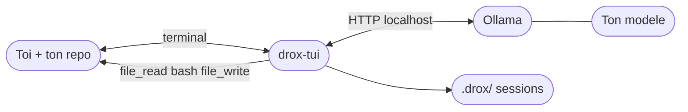
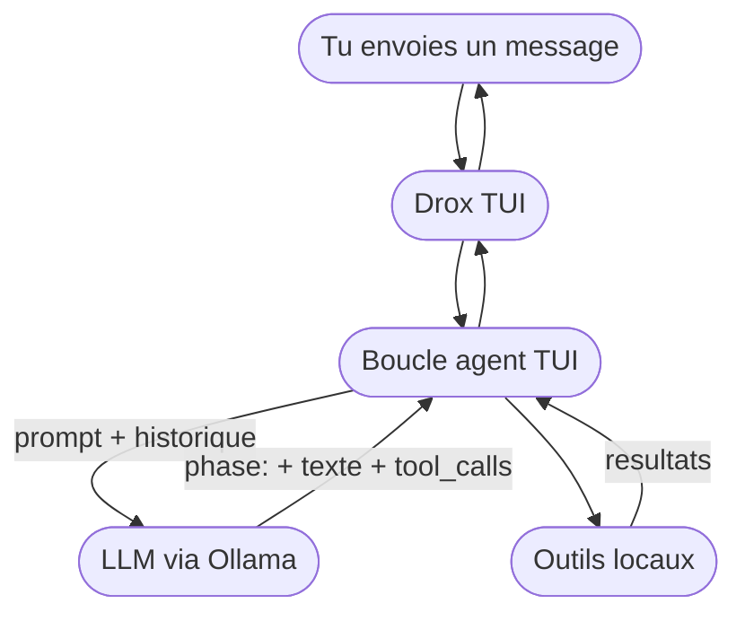
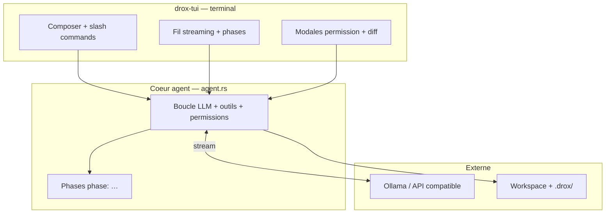
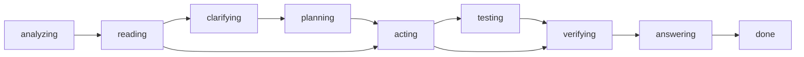

# Drox TUI — releases officielles

## But du projet — souveraineté et feuille de route

### Où en est Drox TUI (2.0.x)

Le TUI est le **cœur agent d’origine** de l’écosystème Drox : une boucle mono-agent (`tui_mono`) en Rust, dérivée du moteur **Drox IDE 1.5.0**, emballée en binaire terminal autonome. La release courante [**2.0.4**](https://github.com/DroxKiwi/Drox---TUI---OR/releases/latest) apporte le **diff visuel** (`/diff`, touche `e`, bandeau fin de run) et peaufine **`/update`** ; les lignes **2.0.5** (diff inline dans le fil) et **2.0.6** (signature installateur, GPG Linux) suivent. Toujours **expérimental** — assistant terminal pour early adopters, pas un produit agent « prod ».

### Souveraineté

Drox TUI vise la **souveraineté numérique** : agent et sessions **en local**, LLM via **Ollama** (ou API que tu configures), données dans **`~/.drox/`** et **`<workspace>/.drox/`** sur ton disque — pas de compte cloud KDDS obligatoire, pas de télémétrie Drox, pas de « phone home ».

**Seule exception réseau côté produit** : la **vérification de version** (lecture de `releases/latest.json` sur le dépôt OR) **si tu l’actives** (`/update on`). Rien d’autre n’est requis pour coder avec l’agent. L’agent n’utilise le réseau que pour ton LLM distant ou les outils web/MCP que **tu** autorises.

### Vision produit

Permettre de **maîtriser des projets volumineux depuis le terminal** avec une **IA légère** (modèles locaux ou petits modèles distants) — peu gourmande en RAM/VRAM et en tokens. Comprendre d’abord (lecture, grep, plan), agir ensuite (fichiers, bash), avec **permissions explicites** et **observabilité locale** (fil, phases, diffs) pour rester maître du système.

Le TUI sert aussi de **référence UX** pour Drox IDE : le fil chronologique, les phases et les outils agent sont alignés sur cette base.

### Pistes à venir (brainstorm)

Plans produit documentés côté sources KDDS — voir aussi la vision partagée [Drox IDE](https://github.com/DroxKiwi/Drox---IDE) ([index brainstorm](https://github.com/DroxKiwi/Drox---IDE/blob/main/drox-engine/docs/feature-brainstorm/README.md)) :

| Thème | Objectif | Ligne |
|-------|----------|-------|
| **Diff visuel overlay** | `/diff`, viewer coloré, `e` sur les patches | ✅ **2.0.4** |
| **Diff inline fil** | Diffs dans le transcript, split pane (style Claude Code) | **2.0.5** |
| **Confiance install** | Authenticode Windows, signatures GPG Linux | **2.0.6** |
| **Télémétrie locale** | KPI par run, dashboards **100 % locaux** (`.drox/`) — aucun cloud | piste |
| **i18n FR/EN** | Interface et messages utilisateur bilingues | en cours |
| **Animation démarrage** | Splash ASCII / halo au boot | piste |
| **Sessions & long run** | Gros chantiers multi-heures ; reprise historique | en cours |
| **IA légère & perf** | Réponses rapides ; presets modèle par rôle | aligné IDE |

Ces pistes **ne bloquent pas** les releases courantes ; elles nourrissent la ligne **2.0.x+**.

---

## ⚠️ STATUT — version 2.0.4 (juin 2026)

> **Drox TUI 2.0.4** : diff visuel M1–M4, pastille header `[MAJ on/off]`, correctif réponses assistant en double — moteur **1.5.0** (`tui_mono`).  
> Toujours **expérimental** — early adopters / dogfood.

| | |
|---|---|
| **Version** | [**2.0.4**](https://github.com/DroxKiwi/Drox---TUI---OR/releases/latest) (juin 2026) · moteur **1.5.0** |
| **Plateformes** | **Windows** installateur 2.0.4 · **Linux** tar.gz **2.0.3** (archive 2.0.4 Linux à publier) |
| **Utilisable au quotidien ?** | **Partiellement** — fonctionnel pour le travail agent local ; polish et signing en cours. |
| **Nouveautés 2.0.4** | `/diff` overlay · `--stat` · navigation status · `e` sur diffs · bandeau fin de run · `/update` polish. |
| **2.0.x−** | **2.0.3** : `/update` opt-in, Linux first-class. **2.0.2** : i18n. |

**En bref** : *le terminal où vit la boucle agent Drox — diff enfin lisible, MAJ sous contrôle.*

---

**Ce dépôt** : binaires Windows/Linux, manifestes MAJ (`releases/latest.json`), notes de version.  
**Pas les sources** — moteur & branding propriétaires [KDDS](https://github.com/DroxKiwi).

**Dernière version** : [2.0.4](https://github.com/DroxKiwi/Drox---TUI---OR/releases/latest) · notes [RELEASE_NOTES](releases/v2.0.4/RELEASE_NOTES.md)

| | |
|---|---|
| Installer | [Télécharger](https://github.com/DroxKiwi/Drox---TUI---OR/releases/latest) |
| MAJ auto | `releases/latest.json` (opt-in `/update on`) |
| Ollama (recommandé) | [ollama.com](https://ollama.com/) |
| SmartScreen | Installeur **non signé** — « Éditeur inconnu » au premier lancement (normal) · signing prévu **2.0.6** |

---

## FR — Vue globale

Tu installes **`drox-tui`**, tu fais tourner **Ollama** avec un modèle (Qwen, Gemma, etc.), tu ouvres ton projet en terminal. Chaque message lance **une boucle agent locale** : le TUI appelle ton modèle, exécute les outils (fichiers, bash, grep, web avec permission) et affiche le fil en streaming.

**La pile**



**Un message dans le TUI**



| Brique | Rôle |
|--------|------|
| **Ollama** | Inférence locale — le modèle que **tu** choisis |
| **drox-tui** | Boucle agent, UI terminal, permissions, sessions |
| **Toi** | Repo, modèle, modes `--plan` / `--apply`, règles allow/ask/deny |

Pas de compte cloud KDDS obligatoire. Données session dans **`~/.drox/`** et **`<workspace>/.drox/`**.

---

## FR — Lancer Drox TUI

Après installation, la commande est **`drox-tui`** :

```bash
# Linux / macOS / WSL
cd /chemin/vers/votre-projet
drox-tui --workspace .
```

```powershell
# Windows
cd C:\chemin\vers\votre-projet
drox-tui --workspace .
```

Sans `--workspace`, le répertoire courant est utilisé. Au **premier lancement**, configurez Ollama via **`Ctrl+Shift+L`** ou **`/server`**.

---

## FR — Installation

**Prérequis** : [Ollama](https://ollama.com/) (ou serveur compatible), terminal moderne (Windows Terminal recommandé).

### Windows x64

1. Téléchargez `drox-tui-2.0.4-windows-x64-setup.exe` depuis [Releases](https://github.com/DroxKiwi/Drox---TUI---OR/releases/tag/v2.0.4).
2. Lancez l’**installateur** (double-clic) et suivez l’assistant.
3. Cochez **Ajouter au PATH** si proposé.

Le binaire est installé dans `%LOCALAPPDATA%\Programs\DroxTUI\bin`. Ouvrez un **nouveau** terminal.

### Linux x64

1. Téléchargez `drox-tui-2.0.3-linux-x64.tar.gz` depuis [Releases](https://github.com/DroxKiwi/Drox---TUI---OR/releases) (archive **2.0.4** Linux à venir).
2. Extrayez et installez :

```bash
tar xzf drox-tui-2.0.3-linux-x64.tar.gz
cd drox-tui-2.0.3-linux-x64
./install.sh              # ~/.local/bin
# ou : ./install.sh --system   # /usr/local/bin (sudo)
drox-tui --workspace ~/projets/mon-repo
```

Vérifiez : `drox-tui --list-sessions`

---

## FR — Démarrage rapide

| Option | Rôle |
|---|---|
| `--workspace` | Dossier de travail de l’agent |
| `--apply` | Autorise les écritures fichier réelles |
| `--plan` | Mode plan (pas d’écriture sans validation) |
| `--session ses_…` | Reprend une session |
| `--list-sessions` | Liste les sessions |
| `-v` | Logs dans `~/.drox/tui.log` |

Variables d’environnement : `DROX_SERVER`, `DROX_MODEL`, `DROX_WORKSPACE`, `DROX_API_KEY`.

Au premier lancement, la modale **Connexion IA** enregistre la config dans `~/.drox/tui-preferences.json`.

---

## FR — Architecture : une boucle, un binaire

Contrairement à Drox IDE (Electron + `drox.exe` + shim RPC), le TUI **embarque directement** la boucle agent **1.5.0** — pipeline **`tui_mono`**, sans couche IDE intermédiaire.



| Couche | Responsabilité |
|--------|----------------|
| **UI terminal** | Composer, fil, overlays (`/diff`), modales, thèmes, raccourcis |
| **Cœur agent** | Tours LLM, protocole `[phase: …]`, outils, permissions, session, compaction |
| **Ollama** | Inférence — prompts + schémas outils ; tokens + `tool_calls` |

Chaque envoi déclenche **un run** jusqu’à **`[phase: done]`**. Modes permission : **`--plan`** (lecture/conseil), **`--apply`** (écritures auto), défaut (allow/ask/deny).

---

## FR — Phases agent

Le modèle structure son travail avec des lignes **`[phase: nom]`**. Seul **`[phase: done]`** clôt le run. Le texte sous **`[phase: answering]`** est la réponse visible.



Les phases intermédiaires sont **optionnelles** ; le chemin dépend de la tâche.

---

## FR — Fonctionnalités

- **Fil de conversation** : streaming, markdown, outils, phases repliables
- **Diff visuel** : `/diff`, `/diff --stat`, `/diff <fichier>`, touche **`e`**, bandeau fin de run
- **Composer** : vim (`/vim`), `@fichier`, collage intelligent, images (Ollama)
- **Agent** : lecture/écriture fichiers, grep, bash, web (avec permission), MCP, todos, plan
- **Permissions** : modales avec aperçu (diff, commande bash, plan)
- **Sessions** : reprise, export, rewind
- **Personnalisation** : thèmes, raccourcis clavier, workspaces récents, i18n FR/EN

Sans `--apply`, les modifications fichier sont **proposées** mais non appliquées sur disque.

---

## FR — Raccourcis et commandes

| Raccourci | Action |
|---|---|
| `Ctrl+Shift+L` | Connexion serveur IA |
| `Ctrl+Shift+W` | Changer de workspace |
| `Ctrl+F` | Rechercher dans le fil |
| `Ctrl+R` | Recherche dans l’historique |
| `Esc` / `Ctrl+C` | Annuler un run |
| `e` | Agrandir diff / sortie d’outil |
| `/help` | Liste des commandes slash |

Commandes utiles : `/server`, `/workspace`, `/settings`, `/theme`, `/permissions`, `/diff`, `/compact`, `/export`, `/doctor`, `/update`.

---

## FR — Garde-fous

| Mécanisme | Effet |
|-----------|--------|
| Modes `--plan` / `--apply` / défaut | Contrôle des écritures et bash |
| Permissions chemins + bash | Allow / ask / deny sur le workspace |
| `[phase: done]` | Clôture explicite du run |
| Compaction contexte | Snip / résumé quand la fenêtre LLM déborde |
| Modales permission | Aperçu diff/bash avant acceptation |

---

## FR — Persistance session

```text
~/.drox/
├── tui-preferences.json   # LLM, thème, MAJ
├── keybindings.json
├── settings.json
├── sessions/              # transcripts JSONL
└── tui.log                # logs (-v)

<workspace>/.drox/         # réglages et mémoire projet
```

---

## FR — Mises à jour

Par défaut, **aucune** vérification automatique.

- **`/update on`** / **`/update off`** — opt-in ; pastille header `[MAJ on]` / `[MAJ off]`
- **`/update check`** — contrôle manuel vers `releases/latest.json`
- **`/update install`** — téléchargement HTTPS, SHA256, confirmation
- **`Ctrl+Shift+U`** — installer ou snooze

Seule communication produit Drox vers l’extérieur : **vérification de version** sur le dépôt OR (opt-in).

---

## FR — Ce que le produit n’est pas

| Pas | Détail |
|-----|--------|
| Agent terminal « prod » | Toujours expérimental — mais base 2.0.x solide |
| IDE graphique | Voir [Drox IDE](https://github.com/DroxKiwi/Drox---IDE---OR) pour l’éditeur |
| Cloud Drox obligatoire | LLM et données restent chez toi |
| Installateur signé | Prévu **2.0.6** (Authenticode + GPG) |
| Code source moteur ouvert | — |

---

## EN — Project goal — sovereignty and roadmap

### Where Drox TUI stands (2.0.x)

The TUI is the **original agent core** of the Drox ecosystem: a Rust **mono-agent loop** (`tui_mono`), derived from **Drox IDE 1.5.0**, shipped as a standalone terminal binary. Current release [**2.0.4**](https://github.com/DroxKiwi/Drox---TUI---OR/releases/latest) adds **visual diff** (`/diff`, `e` key, end-of-run banner) and polishes **`/update`**; **2.0.5** (inline diff) and **2.0.6** (installer signing, Linux GPG) follow. Still **experimental** — not a production daily driver.

### Sovereignty

Drox TUI aims for **digital sovereignty**: local agent and sessions, LLM via **Ollama** (or an API you configure), data in **`~/.drox/`** and **`<workspace>/.drox/`** — no mandatory KDDS cloud account, no Drox telemetry, no phone home.

**Only product-side network exception**: **version check** (reading `releases/latest.json` on the OR repo) **if you enable it** (`/update on`). Nothing else is required. The agent uses the network only for your remote LLM or web/MCP tools **you** allow.

### Product vision

**Master large codebases from the terminal** with **lightweight AI** (local or small remote models) — low RAM/VRAM and token use. Understand first (read, grep, plan), act second (files, bash), with **explicit permissions** and **local observability** (stream, phases, diffs).

The TUI is also the **UX reference** for Drox IDE: chronological stream, phases, and agent tools align on this foundation.

### Upcoming themes (brainstorm)

Product plans in this repo — shared vision with [Drox IDE](https://github.com/DroxKiwi/Drox---IDE) ([brainstorm index](https://github.com/DroxKiwi/Drox---IDE/blob/main/drox-engine/docs/feature-brainstorm/README.md)):

| Theme | Goal | Line |
|-------|------|------|
| **Visual diff overlay** | `/diff`, colored viewer, `e` on patches | ✅ **2.0.4** |
| **Inline diff in stream** | Diffs in transcript, split pane | **2.0.5** |
| **Install trust** | Windows Authenticode, Linux GPG | **2.0.6** |
| **Local telemetry** | Per-run KPIs, **100 % local** dashboards | planned |
| **FR/EN i18n** | Bilingual UI | ongoing |
| **Boot animation** | ASCII splash / halo | planned |

These themes **do not block** current releases; they feed **2.0.x+**.

---

## EN — Status (2.0.4)

> **Drox TUI 2.0.4** : visual diff M1–M4, header `[MAJ on/off]` badge, duplicate assistant reply fix — **1.5.0** engine (`tui_mono`).  
> Still **experimental**.

| | |
|---|---|
| **Version** | [**2.0.4**](https://github.com/DroxKiwi/Drox---TUI---OR/releases/latest) (June 2026) · engine **1.5.0** |
| **Platforms** | **Windows** installer 2.0.4 · **Linux** tar.gz **2.0.3** (2.0.4 Linux archive pending) |
| **Daily driver?** | **Partially** — solid for local agent work; polish and signing in progress. |
| **2.0.4 highlights** | `/diff` overlay · `--stat` · status navigation · `e` on diffs · end-of-run banner · `/update` polish. |

**In short**: *the terminal home of the Drox agent loop — diffs you can read, updates under your control.*

---

## EN — Overview

Install **`drox-tui`**, run **Ollama**, open your project in a terminal. Each message runs a **local agent loop**: the TUI calls your model, executes tools (files, bash, grep, web with permission), and streams the transcript.

| Piece | Role |
|-------|------|
| **Ollama** | Local inference — your chosen model |
| **drox-tui** | Agent loop, terminal UI, permissions, sessions |
| **You** | Repo, model, `--plan` / `--apply`, allow/ask/deny rules |

No mandatory KDDS cloud. Session data in **`~/.drox/`** and **`<workspace>/.drox/`**.

---

## EN — Launch & install

```bash
cd /path/to/your-project
drox-tui --workspace .
```

**Windows**: download `drox-tui-2.0.4-windows-x64-setup.exe` from [Releases](https://github.com/DroxKiwi/Drox---TUI---OR/releases/tag/v2.0.4).

**Linux**: download `drox-tui-2.0.3-linux-x64.tar.gz` (2.0.4 Linux pending), run `./install.sh`.

First launch: configure Ollama via **`Ctrl+Shift+L`** or **`/server`**.

| Option | Role |
|---|---|
| `--workspace` | Agent working directory |
| `--apply` | Allow real file writes |
| `--plan` | Plan mode |
| `--session ses_…` | Resume session |
| `-v` | Logs to `~/.drox/tui.log` |

---

## EN — Architecture

Unlike Drox IDE (Electron + `drox.exe` + RPC shim), the TUI **embeds** the **1.5.0** agent loop directly — **`tui_mono`**, no IDE layer.

Each send runs until **`[phase: done]`**. Phases: `analyzing` → `reading` → optional `clarifying` / `planning` → `acting` → `testing` / `verifying` → `answering` → **`done`**.

---

## EN — Features & shortcuts

- Visual diff: `/diff`, `/diff --stat`, `/diff <file>`, **`e`**, end-of-run banner
- Streaming transcript, markdown, tools, collapsible phases
- Composer: vim, `@file`, smart paste, images (Ollama)
- Permission modals with previews; sessions: resume, export, rewind
- Themes, keybindings, FR/EN i18n

| Shortcut | Action |
|---|---|
| `Ctrl+Shift+L` | AI server connection |
| `Ctrl+Shift+W` | Change workspace |
| `e` | Expand diff / tool output |
| `/update on` | Enable update checks (opt-in) |

Without `--apply`, file writes are **previewed** only.

---

## EN — Updates

Update checks are **opt-in** (`/update on`). When enabled, the client reads `releases/latest.json` — the **only** Drox product communication channel. [Releases](https://github.com/DroxKiwi/Drox---TUI---OR/releases).

---

## EN — What the product is not

| Not | Detail |
|-----|--------|
| Production agent terminal | Still experimental — solid 2.0.x foundation |
| Graphical IDE | See [Drox IDE](https://github.com/DroxKiwi/Drox---IDE---OR) |
| Mandatory Drox cloud | LLM and data stay local |
| Signed installer | Planned **2.0.6** |
| Open engine source | — |

---

## Liens / Links

| FR | EN |
|----|-----|
| [Releases](https://github.com/DroxKiwi/Drox---TUI---OR/releases) | Binaires officiels |
| [RELEASE_NOTES 2.0.4](releases/v2.0.4/RELEASE_NOTES.md) | Notes de version |
| [RELEASE_NOTES 2.0.3](releases/v2.0.3/RELEASE_NOTES.md) | Release précédente |
| [Drox IDE OR](https://github.com/DroxKiwi/Drox---IDE---OR) | Produit sœur (éditeur) |
| [Issues](https://github.com/DroxKiwi/Drox---TUI---OR/issues) | Install & MAJ |

---

## Licence

MIT — voir le fichier `LICENSE` fourni avec l’archive d’installation.

---

*KDDS — Drox TUI. Moteur agent dérivé de Drox IDE 1.5.0.*
